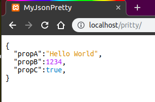

# PrettyJson
_Llevando **stringify** a otro nivel_ :rocket:

   

---

La función `prettyJson` presenta una manera de mostrar código de manera agradable al ojo humano, todo listo para incrustar en un documento html.

## Instalación
Incluya la siguiente etiqueta script a su documento y llame al método `prettyJson()` incluyendo el objeto a parsear.
```html
<script src="https://crystal-moon.github.io/prettyJson/js/prettyJson_v-0.1.0.min.js"></script>
```

## Sintaxis
```javascript
prettyJson(myObject [,config [,color]]);
```

### Parametros

- **myObject**  
El objeto JSON a parsear.

- **config |**`opcional`  
Opcional. Un objeto de configuración cuyas propiedades afectaran al resultado visual. Para mas detalles sobre este parámetro consulte [aquí](js/readme.md).

- **color |**`opcional`  
Opcional. Un objeto que describirá los colores elegidos para cada parte del resultado. Para saber mas sobre este parámetro consulte [aquí](css/readme.md)

- **Retorno**  
Este método retornara un elemento `<div>` listo para ser insertado en el documento html.

## Descripción

**prettyJson** analiza cada propiedad del objeto y en base a su tipo de valor crea elementos `<span>` y `<div>` preparando un árbol DOM que representara de la mejor manera y a todo color su código.


## Ejemplo simple
Puede copiar y ejecutar el siguiente ejemplo, jugando con las propiedades de `myobj`, para probar distintas posibilidades.

```html
<!DOCTYPE html>
<html>
<head></head>
<body>

<p id="myCode"></p>

<script src="https://crystal-moon.github.io/prettyJson/js/prettyJson_v-0.1.0.min.js"></script>
<script>
let myCode = document.querySelector('#myCode');
let myobj = {
	propA:'Hello World',
	propB: 1234,
	propC: true
}
let prettyDiv = prettyJson(myobj);

myCode.appendChild(prettyDiv);

</script>
</body>
</html>
```
**El resultado sera:**



Emmm... Bueno... hasta aqui nada nuevo, no? Se puede conseguir un resultado similar con `JSON.stringify()`, porque usar `prettyJson()`?

##### :bomb: Parametro "replacer"
Al igual que [_stringify_](https://developer.mozilla.org/es/docs/Web/JavaScript/Referencia/Objetos_globales/JSON/stringify#Par%C3%A1metros), _prettyJson_ admite una función o matriz de valores que afectara al objeto resultante. :blush:
##### :bomb: Numero de linea y tabulaciones
_prettyJson_ puede colocar el numero de linea en el margen izquerdo del código y customizar el tamaño de las tabulaciones para darle un aspecto mas _'code'_ :wink:
##### :bomb: En cualquier etiqueta
El resultado de _prettyJson_ no se limita a presentarse en etiquetas `<pre>` y/o `<code>` como otras librerías, puede ser incrustado en cualquiera que funcione como bloque, ya que cuenta con su propio conjunto de clases CSS para mantener el orden visual.
##### :bomb: Valores no permitidos
Como es de común conocimiento, al usar _stringify_, los valores de tipo `function`,`Symbol`,`NaN`, entre otros, son convertidos a `null`. Pero _prettyJson_ puede evitarlo y "prettyfiarlos" a todo color por usted!! :flushed:
##### :bomb: arrow functions
Porque permitir el parseo de funciones no alcanzaba, _prettyJson_ también puede convertir _functions_ a _arrow functions_ y viceversa :scream: Presente su código entendible para programadores de ayer, de hoy y de mañana!
##### :bomb: Fuente personalizable
El simple `monospace` ya no va... Elije tu propia fuente unica y diferente! :grimacing::grimacing::grimacing:
(Por defecto **prettyJson** usa la fuente [Ubuntu-Mono](https://fonts.google.com/specimen/Ubuntu+Mono) proporcionada por GoogleFonts &reg;)
##### :bomb: A todo color!!
Puedes elejir el color de cada tipo de valor, de operadores, hasta elejir el color de las palabras reservadas de Javascript. :art:

_Consulta todas estas opciones y mas en los detalles del parámetro [**config**](./js/readme.md)._
___
##  Compatibilidad con navegadores

| |  |  |  ||
| :-: | :-: | :-: | :-: | :-: |
|**45+**|**22+**|**32+**|**12+**|**10.1+**|

:warning: _prittyJson **NO** es compatible con **Internet Explorer**, ni lo será_ :poop::poop: 

---

:carousel_horse: Todo proyecto de mi autoría es de libre uso y mejora para quién desee hacerlo :octocat:  
_Hecho con amor por [**CrystalMoon**](https://www.linkedin.com/in/perla-stto/)_ :heart: